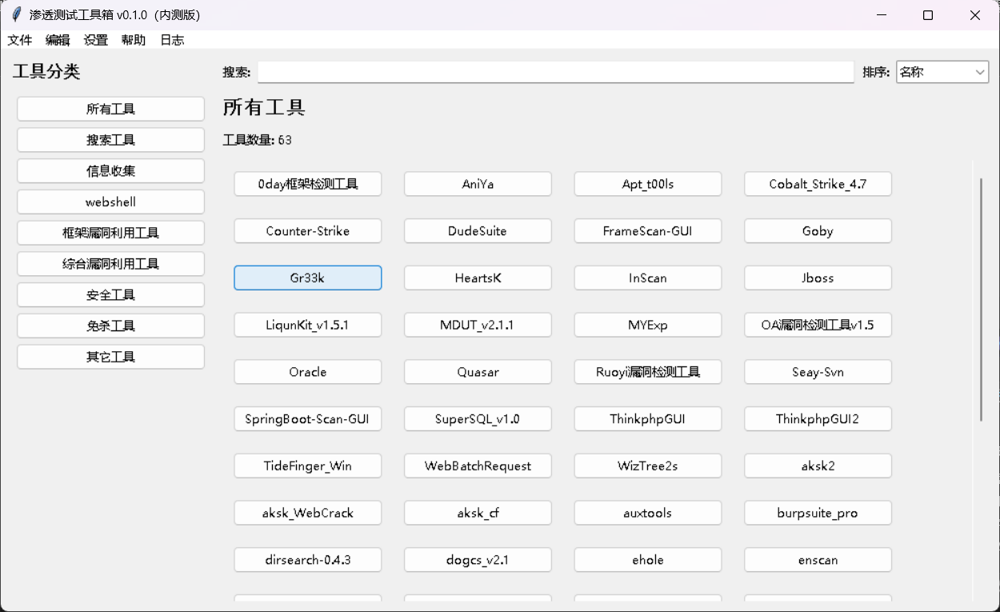

# 渗透测试工具箱

[](LICENSE)
[](https://www.python.org/downloads/)
[](https://docs.python.org/3/library/tkinter.html)

一个基于 Python 和 Tkinter 的模块化渗透测试工具箱，支持多种工具类型和环境配置。

公用：这不仅仅是一个渗透测试工具箱，一切工具都可以添加进来使用。

## 特性

- **模块化设计**：工具和功能模块化，便于扩展和维护img/
- **配置驱动**：通过配置文件管理工具和环境变量
- **多种工具类型支持**：支持 Python、Java、可执行文件、批处理文件等多种工具类型
- **用户友好的 GUI**：直观的图形界面，方便管理和运行工具
- **日志记录**：详细记录工具运行日志，便于调试和审计
- **自定义工具**：支持添加和删除自定义工具

## 安装

### 前置条件

- Python 3.6 或更高版本
- Tkinter（通常随 Python 一起安装）

### 安装步骤（方法1）

1. 克隆仓库
   ```bash
   git clone https://github.com/AiENG07/My_ToolBox.git
   cd penetration-toolbox
   ```

2. 安装依赖（如果需要，大都是python自带库）
   ```bash
   pip3 install -r requirements.txt
   ```

3. 创建配置文件
   - 配置为 `config.ini`
   - 根据需要修改配置文件内容

4. 运行工具箱
   ```bash
   python3 main.py
   ```
### 安装步骤（方法2）
1. 下载压缩包
   - 下载压缩包 `penetration-toolbox.zip` 到本地
   - 解压压缩包到任意目录
2. pyinstaller打包
   - 进入解压后的目录
   - 执行以下命令打包程序，打包后的程序会在 `dist` 目录下生成
   ```bash
     pyinstaller -F --version-file other/version.txt -i other/favicon.ico -w -n 渗透测试工具箱v0.1.0(内测版) 1_main.py
     ```
     - 其中 `--version-file` 是指定版本文件，`-i` 是指定图标，`-w` 是指定窗口模式，`-n` 是指定程序名称, 1_main.py 是主程序文件
     - 将打包好的程序拷贝到My_TOOLBOX目录下
3. 运行工具箱
   - 双击运行 `打包的程序名.exe` 文件
   - 或者在命令行中运行 `打包的程序名.exe`

### 安装步骤（方法3）
直接下载打包好的exe可执行文件
必须文件：
- `config.ini`配置文件，编写你的工具配置
- `打包的程序名.exe` 程序，打包的程序
- `Environment` 目录，存放你的工具环境
- `tools` 目录，存放你的工具

## 使用方法

### 启动工具箱

运行主程序后，工具箱将加载配置文件中的工具，并显示在主界面。

### 工具管理

- **查看工具**：左侧分类列表显示工具分类，点击分类可查看该分类下的工具
- **搜索工具**：在搜索框中输入关键词，可快速过滤工具
- **排序工具**：可按名称、类型或描述对工具进行排序
- **运行工具**：点击工具按钮即可运行对应工具
- **工具详情**：右键点击工具按钮，可查看工具详情

### 添加新工具

1. 点击菜单栏的 **编辑 -> 添加工具**
2. 填写工具名称、分类、路径、类型等信息
3. 点击 **保存** 按钮完成添加

### 删除工具

1. 点击菜单栏的 **编辑 -> 删除工具**
2. 选择要删除的工具
3. 点击 **删除** 按钮确认删除

### 查看日志

1. 点击菜单栏的 **日志 -> 查看日志**
2. 在日志窗口中可查看工具运行日志
3. 支持刷新、清空日志和打开日志文件

### 窗口设置

- **调整窗口大小**：可通过菜单栏的 **设置 -> 窗口大小** 调整窗口尺寸
- **调整每行工具数量**：可通过菜单栏的 **设置 -> 每行工具** 调整每行显示的工具数量

## 配置文件说明

配置文件 `config.ini` 是工具箱的核心配置文件，包含以下内容：

### 环境变量配置示例

```ini
[environments]
java8_path = Environment/Java/jdk1.8.0_131/bin
java9_path = Environment/Java/Java_9.0.4/bin
java11_path = Environment/Java/Java_11.0.2/bin
python27_path = Environment/Python/Python27/
python38_path = Environment/Python/Python38/
```

- `python版本_env`：Python 环境路径
- `java版本_env`：Java 环境路径

### 工具配置示例

```ini
[fscan]
category = 信息收集
path = tools/infoscan/fscan/fscan.exe
type = cmd
description = fscan是一款内网综合扫描工具。

[dirsearch-0.4.3]
category = 信息收集
path = tools/infoscan/dirsearch-0.4.3/dirsearch.py
type = py
env = python38_path
args = -h
description = dirsearch是一款用于扫描网站目录的工具。

[冰蝎v4.1]
category = webshell
path = tools/webshell/Behinder/Behinder.jar
type = jar
env = java8_path
args = -noverify -Dfile.encoding=utf-8 -Xmx2048m
description = 冰蝎v4.1是一款Webshell管理工具
```

- `category`：工具分类
- `path`：工具路径
- `type`：工具类型如 python OR py、java OR jar、exe 、cmd（exe需要命令行窗口的） 、bat 、jcmd（jar包但需要命令窗口打开的）等
- `env`：工具运行所需的环境变量
- `args`：工具运行时的参数
- `description`：工具的详细描述

## 扩展工具

### 添加自定义工具

1. 将工具文件放置在tools目录下合适的位置
2. 在 `config.ini` 文件中添加工具配置
3. 重新启动工具箱，新工具将自动加载

### 支持的工具类型

- `python`or`py`：Python 脚本
- `java`or`jar`：Java 程序（.jar 文件）
- `exe`：可执行文件
- `cmd`：需命令行工具
- `bat`：批处理文件
- `jcmd`：带 Java 参数的命令行工具

## 日志功能

工具箱会将所有操作和工具运行日志记录到 `log/app.log` 文件中，便于调试和审计。

### 查看日志

1. 点击菜单栏的 **日志 -> 查看日志**
2. 在日志窗口中查看详细日志
3. 可通过菜单中的按钮刷新、清空日志或打开日志文件


## 注意事项
- 确保工具路径正确，且工具文件存在
- 配置文件 `config.ini` 中 `environments` 部分为环境变量配置，确保环境变量正确设置
- 配置文件 `config.ini` 中 `tools` 部分为工具配置，确保配置正确
- 运行工具时，确保环境变量和路径正确，且工具文件存在

## 贡献指南

欢迎贡献代码或提出改进建议！
希望优化代码结构，添加更多功能，修复已知问题，完善文档。

1. 叉仓库 (Fork the repository)
2. 创建新分支 (Create a new branch)
3. 提交更改 (Commit your changes)
4. 提交拉取请求 (Create a pull request)

## 许可证

本项目采用 [MIT License](LICENSE) 许可证。
